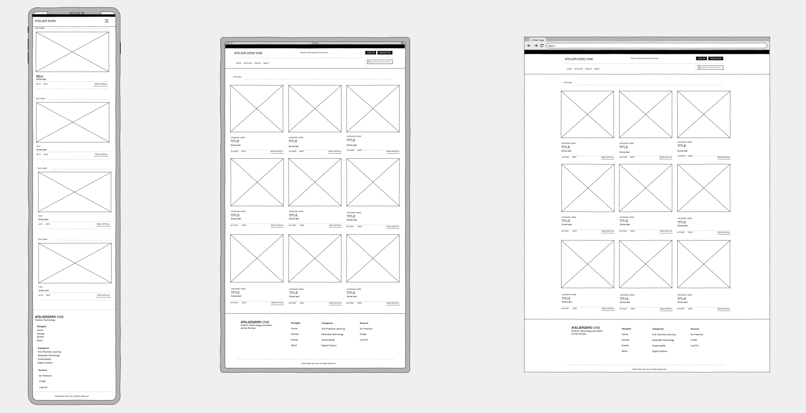
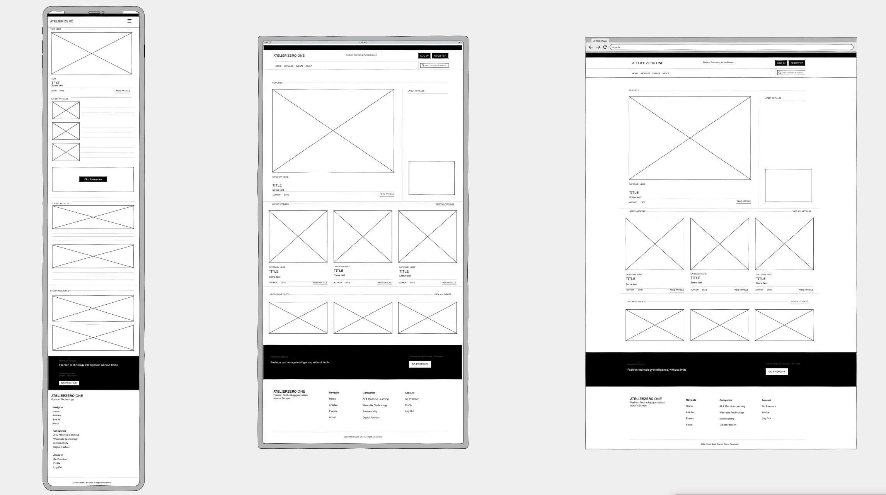
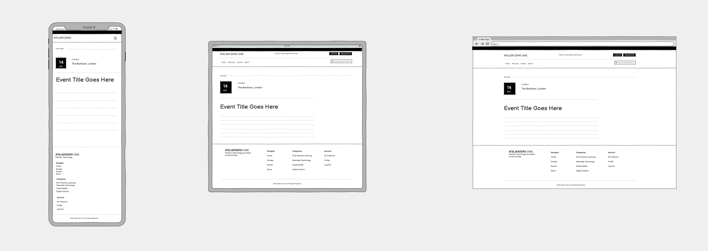
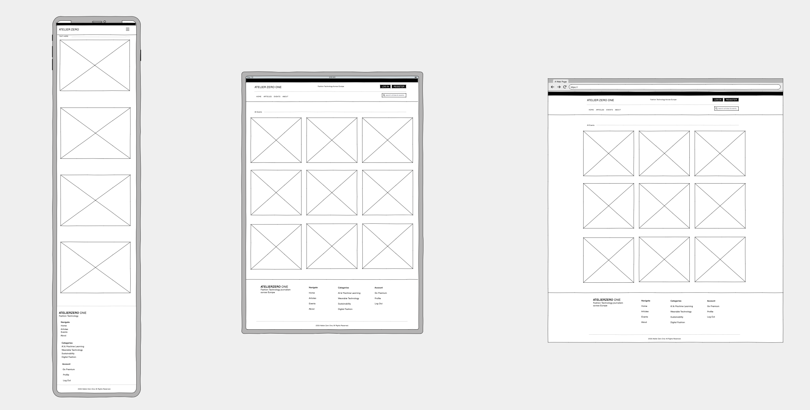
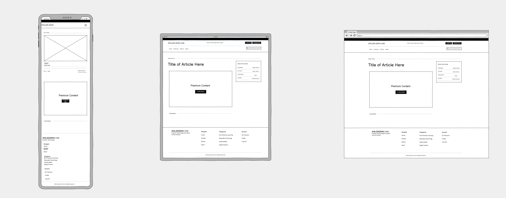
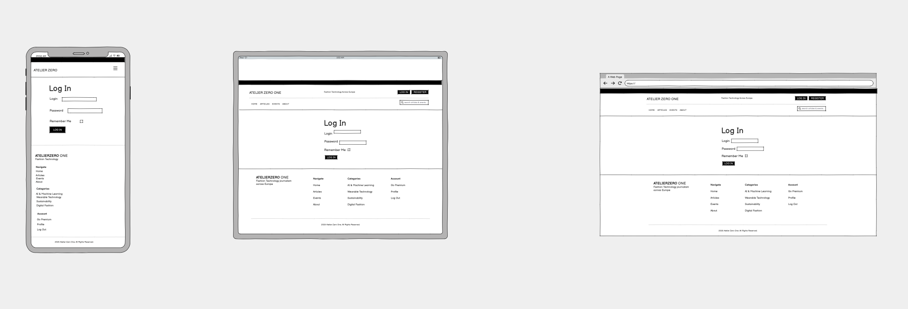
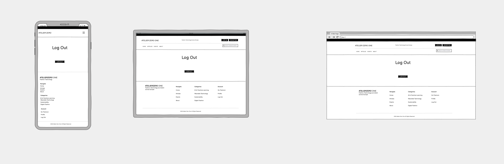
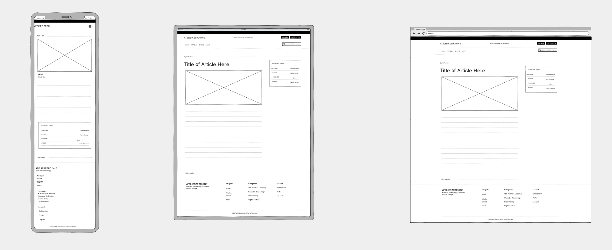
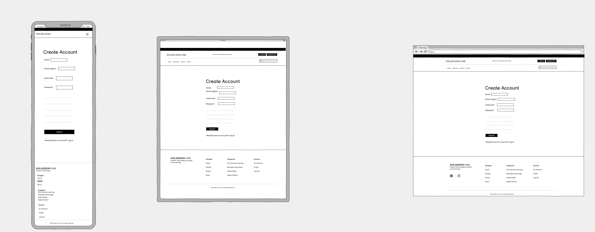
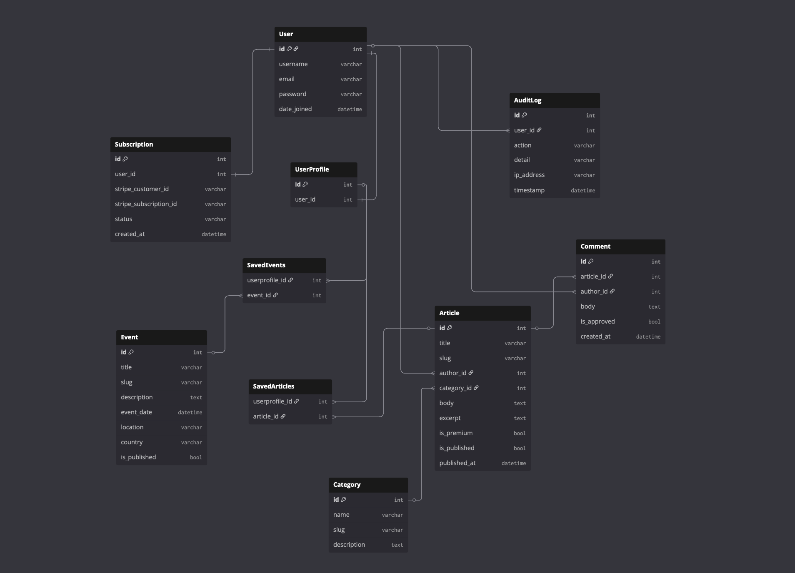

# Atelier Zero One
A full stack editorial platform covering the intersection of technology and fashion across Europe. Built with Django, the platform allows visitors to browse articles freely, registered users to save articles and leave comments, and premium subscribers to unlock exclusive long-form content via a Stripe powered subscription.

**Live URL:** https://atelier-zero-one-55eb03950c75.herokuapp.com
**GitHub:** https://github.com/sineadezita/milestone-project-4

---

## Table of Contents
- [Project Purpose & Value](#project-purpose--value)
- [Target Audience](#target-audience)
- [UX Design](#ux-design)
- [Features](#features)
- [Apps & Structure](#apps--structure)
- [Data Models & Schema](#data-models--schema)
- [Technologies Used](#technologies-used)
- [Setup & Installation](#setup--installation)
- [Environment Variables](#environment-variables)
- [Stripe Integration](#stripe-integration)
- [Testing](#testing)
- [Deployment](#deployment)
- [Credits & Attribution](#credits--attribution)
- [Future Features](#future-features)

---

## Project Purpose & Value

Atelier Zero One fills a gap in the European market for focused, professional reporting on technology as it applies to the fashion industry. Topics include AI-driven personalisation, wearable technology, sustainable supply chains, augmented reality retail, and digital fashion.

**Value to users:**
- Visitors can freely discover articles and assess whether the publication suits them
- Registered users get a personalised reading list and can engage via comments
- Premium subscribers unlock full access to in-depth reports and analysis

The purpose of the site is immediately evident on arrival: a clean editorial homepage communicates the publication's direction and focus, and the premium content lock clearly signals why registration and subscription add value.

---

## Target Audience

| Audience | Need |
|----------|------|
| Fashion industry professionals | Stay current on technology disrupting their sector |
| Tech professionals entering fashion | Understand the domain they are moving into |
| Students & Researchers | Access focused, reliable editorial content |
| Investors & analysts | Monitor trends in fashion technology across Europe |

---

## UX Design

### Design Principles

Atelier Zero One follows a minimal editorial aesthetic. The design prioritises readability and content hierarchy over visual decoration, ensuring the purpose of the site is immediately clear to a new user.

Key UX decisions:

- **Information hierarchy**: Featured article leads the homepage, supported by category filtering, so users can orient themselves instantly
- **User Control:** Premium content is clearly signposted before a user reaches a paywall, so they are never surprised
- **Consistency:** The same card layout, typography, and spacing is used across all article listings
- **Feedback:** All user actions (login, save article, comment submit, subscription) produce clear success or error messages
- **Accessibility:** Semantic HTML, sufficient colour contrast and keyboard-navigable forms throughout

### User Stories

User stories were tracked using [GitHub Projects](https://github.com/sineadezita/milestone-project-4/projects).

| User Type | I can... | So that... |
|-----------|----------|------------|
| Visitor | Browse articles freely | I can assess the publication |
| Visitor | Register for an account | I can access personalised features |
| Registered user | Save articles | I can build a reading list |
| Registered user | Leave comments | I can engage with content |
| Registered user | Edit and delete my comments | I can manage my contributions |
| Registered user | Save events | I can track upcoming events |
| Premium subscriber | Read premium articles in full | I get value from my subscription |
| Premium subscriber | View my subscription status | I can manage my account |
| Admin | Add and manage articles | I can publish content |
| Admin | Approve comments | I can moderate the platform |
| Admin | View audit logs | I can monitor user activity |

### Wireframes

Wireframes were created for all main user-facing pages using Balsamiq across desktop, tablet and mobile breakpoints.











---

## Features

### Implemented

- User registration and login
- Save and unsave articles to a personal reading list
- Leave, edit, and delete own comments on articles
- Premium content locked for non-subscribers with clear messaging
- Stripe Checkout subscription (test mode)
- Subscription success and cancellation
- Subscription status shown in user profile
- Responsive layout using Bootstrap 5
- Django admin panel for content management
- Audit log for user actions
- Category filtering on articles list
- Search across articles

### CRUD Summary

| Model | Create | Read | Update | Delete |
|-------|--------|------|--------|--------|
| Article | Admin Panel | All users | Admin Panel | Admin Panel |
| Comment | Registered users | All users | Comment author | Comment author |
| User Profile | Auto on registration | Profile owner | Profile owner | - |
| Saved Article | Registered users | Profile owner | - | Registered users |
| Subscription | Via Stripe checkout | Profile owner | Via Stripe webhook | Via cancellation |

---

## Apps & Structure

| App | Purpose |
|-----|---------|
| `home` | Homepage view and featured content |
| `articles` | Articles and category models, views and templates |
| `events` | Event models, views and templates |
| `accounts` | User profiles, reading list, saved events |
| `subscriptions` | Stripe checkout, webhook, subscription model |
| `comments` | Comment model, add/edit/delete views |
| `audit_log` | Security logging for user actions |

---

## Data Models



---

## Technologies Used

| Category | Technology |
|----------|------------|
| Backend framework | Django 6.0.2 |
| Language | Python |
| Database | SQLite (development) / PostgreSQL (production) |
| Authentication | Django Allauth |
| Payments | Stripe Checkout + Webhooks |
| Frontend framework | Bootstrap 5 |
| JavaScript | Vanilla JS |
| Image hosting | Cloudinary |
| Deployment | Heroku |
| Static files | Whitenoise |
| Version control | Git & GitHub |

---

## Setup & Installation

1. Clone the repository: `git clone https://github.com/sineadezita/milestone-project-4`
2. Create a virtual environment: `python -m venv .venv`
3. Activate it: `source .venv/bin/activate`
4. Install dependencies: `pip install -r requirements.txt`
5. Create `env.py` in the root directory with the required environment variables (see below)
6. Run migrations: `python3 manage.py migrate`
7. Create a superuser: `python3 manage.py createsuperuser`
8. Run the server: `python3 manage.py runserver`

---

## Environment Variables

Create an `env.py` file in the root directory:

```python
import os

os.environ['SECRET_KEY'] = 'your-secret-key'
os.environ['DEBUG'] = 'True'
os.environ['STRIPE_PUBLIC_KEY'] = 'your-stripe-public-key'
os.environ['STRIPE_SECRET_KEY'] = 'your-stripe-secret-key'
os.environ['STRIPE_PRICE_ID'] = 'your-stripe-price-id'
os.environ['STRIPE_WEBHOOK_SECRET'] = 'your-stripe-webhook-secret'
os.environ['CLOUDINARY_CLOUD_NAME'] = 'your-cloud-name'
os.environ['CLOUDINARY_API_KEY'] = 'your-api-key'
os.environ['CLOUDINARY_API_SECRET'] = 'your-api-secret'
```

---

## Stripe Integration

This project uses **Stripe Checkout in test mode only**. No real payments are processed.

### Subscription Flow

1. A logged-in user clicks **Go Premium**
2. They are redirected to Stripe-hosted checkout
3. On success, Stripe fires a `checkout.session.completed` webhook
4. The webhook handler creates a `Subscription` record with status `active`
5. The subscription is also provisioned directly on the success page as a fallback
6. The user is redirected to a success page confirming access is unlocked

### User Feedback

| Outcome | Page shown | Message |
|---------|------------|---------|
| Payment successful | `/subscriptions/success/` | Welcome to Atelier Zero One Premium! |
| Payment cancelled | `/subscriptions/cancel/` | Subscription cancelled. |
| Checkout error | `/subscriptions/` | Something went wrong: [error detail] |

### Stripe Test Card
Card number : 4242 4242 4242 4242 Expiry : Any future date CVC : Any 3 digits
---

## Testing

Full testing documentation is in [TESTING.md](TESTING.md).

---

## Deployment

This project is deployed to **Heroku** using the following steps:

1. Create a Heroku account and log in
2. Create a new Heroku app
3. Add **Heroku Postgres** add-on (Essential-0)
4. Set all environment variables in Heroku Config Vars:
   - `SECRET_KEY`
   - `STRIPE_PUBLIC_KEY`
   - `STRIPE_SECRET_KEY`
   - `STRIPE_PRICE_ID`
   - `STRIPE_WEBHOOK_SECRET`
   - `CLOUDINARY_CLOUD_NAME`
   - `CLOUDINARY_API_KEY`
   - `CLOUDINARY_API_SECRET`
5. Create a `Procfile`: `web: gunicorn atelier_01.wsgi:application`
6. Create `runtime.txt`: `python-3.12.8`
7. Push to GitHub and deploy via Heroku dashboard
8. Run migrations: `heroku run python manage.py migrate --app atelier-zero-one`
9. Create superuser: `heroku run python manage.py createsuperuser --app atelier-zero-one`
10. Load fixtures: `heroku run python manage.py loaddata articles_fixture.json --app atelier-zero-one`

**Live URL:** https://atelier-zero-one-55eb03950c75.herokuapp.com
**GitHub:** https://github.com/sineadezita/milestone-project-4

---

## Credits & Attribution

### Libraries & Dependencies

| Package | Version | Purpose |
|---------|---------|---------|
| Django | 6.0.2 | Core web framework |
| django-allauth | 65.14.3 | User authentication and registration |
| stripe | 14.4.0 | Payment processing and webhooks |
| cloudinary | 1.44.1 | Image hosting and delivery |
| django-cloudinary-storage | 0.3.0 | Cloudinary integration for Django |
| dj-database-url | 3.1.2 | Database URL configuration for Heroku |
| psycopg2-binary | 2.9.11 | PostgreSQL database adapter |
| gunicorn | 25.1.0 | WSGI server for Heroku deployment |
| whitenoise | 6.12.0 | Static file serving in production |
| requests | 2.32.5 | HTTP library |
| asgiref | 3.11.1 | Django async support |
| sqlparse | 0.5.5 | SQL query formatting |

### Code Attribution

- Stripe webhook implementation based on [Stripe Django documentation](https://stripe.com/docs)
- Authentication implemented using [Django Allauth](https://django-allauth.readthedocs.io/)
- Bootstrap 5 components used throughout the frontend

### Design Inspiration

- Editorial design inspired by publications including Vogue Business and Business of Fashion
- Colour palette and typography chosen to reflect a minimal, professional editorial aesthetic

### Content

- Article content written by the developer for the purposes of this project
- Images sourced from [Unsplash](https://unsplash.com) under free licence

---

## Future Features

| Feature | Description |
|---------|-------------|
| Custom auth pages | Styled login, logout and register pages |
| Author profiles | Public author pages with article history |
| Newsletter | Email newsletter for premium subscribers |
| Data journalism | Sentiment analysis of fashion industry trends |
| Search | Full text search across articles and events |
